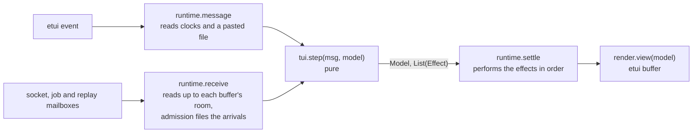
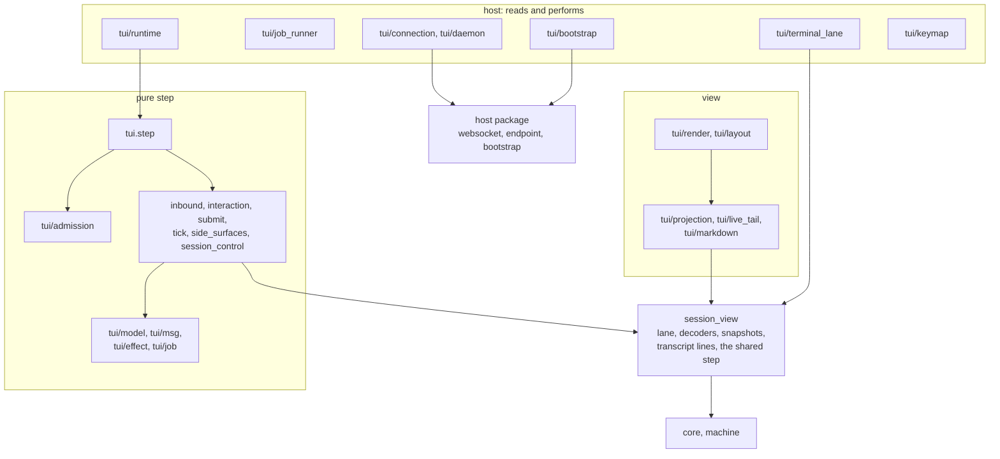
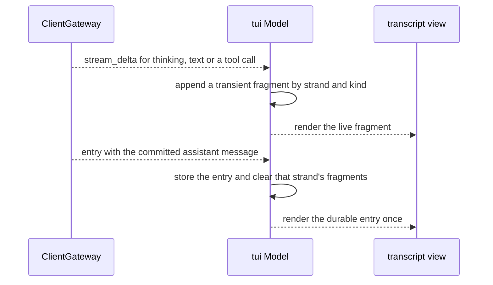

# tui

`tui` is Loom's native terminal client, the `loom` command. It finds or
starts the local `loomd`, authenticates on the daemon's control socket,
lets the operator pick a session, attaches to that session's websocket,
and draws the session live with etui. The same binary also carries the
non-interactive commands: `loom sessions`, `loom replay`, `loom update`,
`loom version`, `loom ext` and `loom evolution` (passed through to `loomd`),
and `loom ui`, which prints a link to the daemon's web view of a session.

The package is the terminal's host for the client engine. Session logic
that does not depend on a terminal (the session lane, the protocol
decoders, snapshot adoption and the transcript's line builders) lives in
[`packages/session_view`](../session_view), which the daemon's web view
also runs. What stays here is what only a terminal needs: the reducers
over the terminal's `Model`, the etui view, and the host code that reads
clocks, files and mailboxes and performs effects. Its step is a pure
function that returns its effects as values (ADR-013), so every
transition can be tested and replayed without a socket.

## Installing and launching

`make tui-shipment` builds the compiled BEAM closure behind `bin/loom`
without ERTS, so it needs a compatible Erlang/OTP 29 on `PATH`.
`make release-client` builds the self-contained client release, which
carries its own ERTS; `make dist` packages both beside the server
(`docs/distribution.md`). With `loomd` beside the launcher, named by
`--server` or `LOOM_SERVER`, or on `PATH`, local use is:

```sh
cd ~/src/my-project
loom
```

The launcher reads the daemon's endpoint record under the private state
root (`~/.loom` unless `--state-dir` says otherwise), checks the daemon's
v2 control `hello` against the published epoch, and starts a detached
`loomd` only when no live daemon answers. Concurrent launchers share an
operating-system lock, and the daemon outlives the terminal, so a later
`loom` reattaches. Implicit daemon discovery expands only absolute `PATH`
entries, because a relative entry would resolve through the workspace;
workspace content is data, not launch authority. With no `--session`, the
launcher opens the session picker on the daemon's catalogue.

## One step, one host

The loop carries one immutable `Model`. For each etui event,
`tui.update` runs four calls, and only the third decides anything. Etui
then draws the new model with `render.view`, a pure function of it:


```mermaid
flowchart LR
    Event["etui event"] --> Message["runtime.message<br/>reads clocks and a pasted file"]
    Mail["socket, job and replay mailboxes"] --> Receive["runtime.receive<br/>reads up to each buffer's room,<br/>admission files the arrivals"]
    Message --> Step["tui.step(msg, model)<br/>pure"]
    Receive --> Step
    Step -->|"Model, List(Effect)"| Settle["runtime.settle<br/>performs the effects in order"]
    Settle --> View["render.view(model)<br/>etui buffer"]
```

`runtime.message` turns the etui event into a `msg.Input` carrying one
reading of each clock, so every reducer in a step sees the same instant.
`runtime.receive` reads the socket inbox, the waiting attachment attempt,
the replay inbox and every running job's replies, and `tui/admission`
files each message into the buffer or slot that waits for it without
reducing anything. `tui.step` then reduces the input; reducers take
traffic from those buffers at a tick or a key, in a fixed drain order, so
an Escape still cancels a waiting command before any reply is reduced.
After phase 3 of ADR-013 the step reads no clock, file, mailbox, process
or environment variable.

Reducers do not perform I/O. They queue `effect.Effect` values: a frame
write or close for the session lane, a job start or cancel keyed by a
never-reused `job.Key`, an inbox discard, a recording line, the OSC 52
clipboard write, or a Herdr report. Every effect carries the handle it
acts on, because an adoption can replace the model's socket later in the
same step and the effect must still reach the socket it was decided for.
`runtime.settle` performs the list in decision order through
`tui/terminal_lane.perform`, `tui/job_runner` and `tui/recording`. A test
calls `tui.step` and asserts on the returned list; `loom replay` and the
golden recordings drive the same step through a virtual backend.

## Where the modules sit


```mermaid
flowchart TD
    subgraph host["host: reads and performs"]
        Runtime["tui/runtime"]
        Jobs["tui/job_runner"]
        Lane["tui/terminal_lane"]
        Conn["tui/connection, tui/daemon"]
        Boot["tui/bootstrap"]
        Keymap["tui/keymap"]
    end
    subgraph engine["pure step"]
        Step["tui.step"]
        Admission["tui/admission"]
        Reducers["inbound, interaction, submit,<br/>tick, side_surfaces, session_control"]
        Model["tui/model, tui/msg,<br/>tui/effect, tui/job"]
    end
    subgraph view["view"]
        Render["tui/render, tui/layout"]
        Projection["tui/projection, tui/live_tail,<br/>tui/markdown"]
    end
    SV["session_view<br/>lane, decoders, snapshots,<br/>transcript lines, the shared step"]
    HostPkg["host package<br/>websocket, endpoint, bootstrap"]
    Runtime --> Step
    Step --> Admission
    Step --> Reducers
    Reducers --> Model
    Reducers --> SV
    Projection --> SV
    Render --> Projection
    Lane --> SV
    Conn --> HostPkg
    Boot --> HostPkg
    SV --> Core["core, machine"]
```

`gleam.toml` has the package edges: `session_view`, `host`, `core` and
`machine` from the tree, and `etui`, `weft`, `gun`, `argv`,
`simplifile` and `filepath` from outside. `session_view` imports only
`core`, `machine` and the standard library, and lint R6 holds it there.
Nothing in `session_view` imports `tui`.

## Durable rows and live fragments are different things

The gateway publishes both durable entries and transient stream
fragments, and they may carry the same answer at different moments:
fragments make the answer visible while it is generated, then the
committed assistant entry becomes the authority. Combining both into one
transcript would show the answer twice when it settles.

The model therefore keeps two collections. `records` holds entries
decoded by the total `core/codec` decoders (through
`session_view/protocol`); `streams` holds text fragments keyed by strand
and stream kind. Durable rows are wrapped once and cached by strand,
width and detail mode, and a stream revision rewraps only its live
fragments (`tui/live_tail`). An incoming entry clears that strand's
fragments and adds only the new durable rows. This is the harness's
two-channel doctrine seen from the client: live output is feedback, and
only a committed entry is conversation history.


```mermaid
sequenceDiagram
    participant G as ClientGateway
    participant T as tui Model
    participant V as transcript view

    G-->>T: stream_delta for thinking, text or a tool call
    T->>T: append a transient fragment by strand and kind
    T-->>V: render the live fragment
    G-->>T: entry with the committed assistant message
    T->>T: store the entry and clear that strand's fragments
    T-->>V: render the durable entry once
```

Reasoning and tool material stay subordinate to the answer. The compact
view gives each one bounded preview row; `Ctrl+G` or `/details` shows the
full durable content. Page Up, Page Down and the mouse wheel move through
the wrapped transcript, and the default position follows the newest row.

## Commands

Ordinary input is a prompt. Input beginning with `/` is a client command.
Typing `/` opens a filtered palette; Up and Down move the selection and
Tab completes it without submitting. The common commands:

| Command | Effect |
|---|---|
| `/model`, `/model <name>` | Open the searchable model selector, or pick one entry. |
| `/sessions` | Open the session picker on the daemon's catalogue. |
| `/agents` | Open the strand and sub-agent inspector (also `Ctrl+O` or `F2`). |
| `/strand <name>`, `/fork <name>` | Move to an existing strand, or fork the active one. |
| `/approve`, `/deny` | Answer a pending approval; the approval dialog opens on its own. |
| `/notes` | Show the latest durable agent-note board. |
| `/queue`, `/steer` | Inspect or add queued input, or inject into the live operation. |
| `/goal` | Show the session goal's status; `/goal ` with arguments acts on it. |
| `/diff` | Show the current worktree changes. |
| `/add-dir <path>`, `/add-write-dir <path>` | Grant the session read, or read and write, access to a directory. |
| `/compact`, `/abort` | Request compaction, or abort the active operation. |
| `/rename <name>` | Rename the session. |
| `/details` | Expand or collapse reasoning and tool records. |
| `/help` | Show every command in the transcript pane. |
| `/quit` | Leave the client without changing the session. |

`/model` searches the configured name, provider dialect and provider
model ID; exact, prefix and substring matches outrank initials-style
fuzzy matches. The agent inspector keeps the draft: arrows inspect
another agent, Enter opens its transcript and changes the recipient,
`n` visits the next agent that needs attention, `a` opens that agent's
pending approval, and Tab moves into its composer. Drafts, attachments
and input history belong to a `(session, strand)` pair, so switching
agents restores each one's editor, and an unsent draft never falls back
to another agent.

A newly pending approval opens `approval_panel`, which shows the captured
action and the exact authority requested. No choice is selected on
opening. Allow once, Allow for session and Deny are chosen explicitly and
confirmed with Enter, and a decision echoes the exact captured action,
grants and sequence (`protocol-change/041`); the panel never widens or
invents authority.

## Evolution controls

`loom evolution` forwards native operator commands to `loomd evolution`.
It attaches to an already resident authenticated session; it does not start
a daemon or open a session. The operator can inspect retained candidates and
evidence, approve an exact identity, select it and roll back to an earlier
approved version.

A queued response is a receipt, so use `status` with the original request ID
to observe publication. The command syntax, exit codes and authority rules
are in [the evolution architecture](../../docs/architecture/evolution.md).

## Markdown remains data

Assistant text crosses two transformations before etui sees it. First,
`session_view/text_hygiene` replaces terminal controls, bidirectional
controls, invisible formatters, variation selectors and tag characters
with a visible replacement glyph. Then `session_view/markdown`, the
parser the web view also draws from, parses the safe text into a closed
tree, and `tui/markdown` maps that tree to etui lines and styles. The
parser is linear in its input, which matters because the live tail parses
an answer again on every delta; mork, which this package used before,
took time exponential in a run of unclosed `[`. There is no HTML
render-and-reparse step and no ANSI intermediate: raw HTML is shown as
text, links keep an OSC 8 destination through etui's own span field, and
model-authored escape bytes cannot become terminal instructions.

Fenced Gleam blocks get token highlighting that splits the original line
into styled spans without rewriting it, so indentation and invalid syntax
stay as the model wrote them. An unresolved `code_mode` call shows up to
six lines of its source; a confirmed success shows a result summary, and
`Ctrl+G` shows the full program and result. Failures keep multiline
diagnostics, bounded to eight lines and 1,600 characters with an
expansion hint. The footer shows the gateway's usage ledger (input,
output, cache reads, cache writes and server-reported cost); the client
keeps no pricing table.

Colors come from `appearance.Palette`, chosen once at launch from
`COLORTERM`, `TERM`, `COLORFGBG` and `NO_COLOR`. Status labels and
selection marks carry their meaning without color.

## Running the client from the package

The dependency floor is Gleam 1.18 and Erlang/OTP 29. From this
directory:

```sh
gleam run -- --demo        # a self-contained preview with no daemon
gleam run                  # the normal local launch
```

`--workspace`, `--state-dir`, `--server` and `--config` override the local
defaults. A remote or manually managed daemon takes its v2 address, a
session id and a bearer token; a token file keeps the credential out of
shell history and process arguments, and must be readable only by you.
Neither `--token-file` nor `--token` accepts a `loomclaim_` claim token;
an invitee redeems one with `loom claim --addr ADDRESS`, which stores the
credential it draws and prints the launch line to use:

```sh
gleam run -- \
  --addr ws://127.0.0.1:8080/v2/control \
  --session <id> \
  --token-file /path/to/owner.token
```

A `/v1/ws` address is refused: the v1 gateway is gone. Cleartext
credentials are allowed only for literal loopback hosts; a remote daemon
needs `wss`. Websocket setup runs through `host/websocket` with a
five-second deadline, and after the handshake a weft lifetime actor owns
the connection and monitors both the attempt and the terminal's inbox,
so a network failure becomes a `Closed` notice instead of killing the
terminal. After a lost connection a local terminal makes one bounded
reconnect attempt, and a held prompt returns to the composer.

`loom ui --session <id>` prints a link to the daemon's web view of that
session (`protocol-change/051`). The page is read-only unless `--operate`
asks for an operator's page, and `--open` also starts the platform's
browser opener. A running daemon started without `--ui` is refused with
status 1 and left alone.

## A tour of the modules

`tui.gleam` holds the entry points (`main`, launch parsing, `new_model`,
`update`, `step`, `run_script`, `replay_steps`, `connect_remote`) and the
event dispatch. The modules under `tui/`, roughly in the order a reader
needs them:

- `tui/msg`: `Msg` is `Input(at, wall_ms, event)`, one event with its
  clock `Stamp` (`session_view/msg`), or `Arrived(arrivals)`, traffic the
  host received.
- `tui/model`: the `Model` record, the terminal's `View` beside the shared
  step's record (`session_view/model.Shared`), the effect outbox with
  `emit`, and the helpers every reducer shares. `hold_shared` stores the
  result of a function over the shared record and applies what it
  recorded for the terminal's surfaces.
- `tui/effect`: `Effect`, the closed vocabulary of effects a step can
  decide on.
- `tui/job`: background jobs as data. `Spec` names the work (a control
  request, a reconnect, an activity poll, an attachment, a session
  configuration) and `Key` names the job.
- `tui/admission`: `admit`, the pure filing of arrivals into the inbox or
  slot that waits for them.
- `tui/inbound`, `tui/interaction`, `tui/submit`, `tui/tick`,
  `tui/side_surfaces`, `tui/session_control`: the terminal's loop over
  received traffic; keys, pastes and the mouse; composer submission; the
  tick and its drain order; the notes, summary, goal and context panels'
  openers; and daemon control and reconnection. The session's reducers
  (the folds, the commands, the side-surface reads) are in
  `session_view`.
- `tui/attachment`: one provisional attachment attempt, adopted only
  after a validated cut, a completed worker and a passed adoption check.
- `tui/runtime`, `tui/job_runner`, `tui/terminal_lane`, `tui/buffered`:
  the host. They read clocks, files and mailboxes, perform effects, run
  jobs as one-task weft runs, and own the terminal's lane handles.
- `tui/connection`, `tui/daemon`, `tui/daemon/protocol`,
  `tui/daemon/selection`, `tui/bootstrap`: the session socket over
  `host/websocket`, the control connection and its total codec, session
  opening, and daemon discovery and launch.
- `tui/render`, `tui/layout`, `tui/projection`, `tui/live_tail`,
  `tui/markdown`: the pure view, the record row caches and the streaming
  tail.
- `tui/agents`, `tui/agent_view`, `tui/agent_strip`, `tui/approval_panel`,
  `tui/session_selector`, `tui/todo_panel`: the agent workspace, the
  per-agent strip, the approval dialog, the session picker and the todo
  board.
- `tui/recording`, `tui/virtual_backend`, `tui/frame`: `--record` files,
  the scripted backend `loom replay` and the golden tests drive the loop
  through, and the frame-to-text rendering both of them print.
- `tui/view_link`, `tui/update/*`, `tui/herdr`: `loom ui`, `loom
  update`, and the Herdr pane reporter.

## Testing

```sh
make check-tui
```

runs the format check, a warning-free build and the tests under
`test/`; `make lint-tui` runs the house-rule lint, which only the bare
`make check` includes. The tests drive the real step:
`effects_test`, `jobs_test`, `admission_test` and `keymap_test` pin the
effect lists, job keys and filing; `session_channel_property_test`
generates schedules of submissions, replies, pushed frames and ticks
against the lane; and `test/snapshots/` and `test/recordings/` hold the
golden frames and the golden recording that the tests compare byte for
byte. The
terminal's end-to-end tests against a real daemon live in
`packages/client/test/client/` (`tui_e2e_test`, `tui_v2_test`,
`tui_approval_effect_test`), because `client` is the package that can
boot one. A P model of the attachment protocol is in
`protocol/models/terminal-attachment/` (ADR-013's protocol-model
addendum).

`gleam dev agents dark` (or `light`, `ansi`, `plain`) runs a
provider-free fixture of the agent workspace through the shipped loop.
`make bench-tui` runs the frame-rendering and queued-input benchmarks in
`dev/`; `docs/performance.md` describes the pseudo-terminal workload for
measuring real terminal bytes and latency.

## Reading further

- [`CLAUDE.md`](CLAUDE.md): the key types, dependency edges, traffic and
  invariants, module by module. Read it before changing the package.
- [ADR-013](../../docs/adr/013-tui-effects-as-values.md): the step with
  effects as values, and the phase addenda that took clocks, mailboxes,
  jobs, files and recording out of it.
- [ADR-014](../../docs/adr/014-second-runtime.md): one client engine, two
  views, and what ties the step to the terminal today.
- [`docs/architecture/terminal.md`](../../docs/architecture/terminal.md)
  and [`docs/architecture/client.md`](../../docs/architecture/client.md):
  the terminal and the launcher, endpoint record and v2 wire.
- [`packages/client/protocol.md`](../client/protocol.md): the wire
  bodies.
- [`docs/design-notes/etui-client.md`](../../docs/design-notes/etui-client.md)
  and [`docs/design-notes/tui-agent-workspace.md`](../../docs/design-notes/tui-agent-workspace.md):
  the etui evaluation and the agent workspace review.
