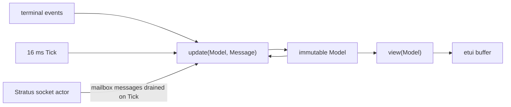
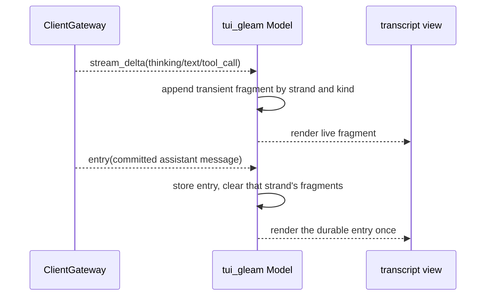

# tui_gleam

`tui_gleam` is the native Gleam client being used to answer issue #114's
practical question: can etui carry Loom's real terminal surface, not just draw
a static screen? It can. This package receives keyboard input in a Herdr PTY,
attaches to the frozen ClientGateway websocket, follows a live session, and
renders Mork's CommonMark tree directly into etui spans.

It is an evaluation, not the shipped client. `packages/tui` remains the
release binary and the behavioral reference until this client implements the
same approval and reconnect guarantees and Loom makes an explicit decision
about the higher Gleam and OTP floors this dependency set requires.

## One model owns the terminal

The etui loop carries one immutable `Model`. Keyboard events, websocket
messages, and periodic inbox drains all produce a new value; `view` only turns
that value into a buffer. No render function performs I/O, and no networking
process owns presentation state.



The socket is an actor because Stratus owns a live websocket connection. It
sends decoded text frames into the terminal loop's `Subject`; the loop drains
that mailbox without blocking whenever etui emits a tick. This boundary keeps
the mutable resource at the edge and leaves every visible decision in the
ordinary Gleam model.

## Durable rows and live fragments are different things

ClientGateway publishes both durable entries and transient stream fragments.
They may contain the same answer at different moments: fragments make the
answer visible while it is generated, then the committed assistant entry
becomes the authority. Combining both into one transcript would show the
answer twice when settlement arrives.

The model therefore keeps two collections. `records` holds entries decoded by
`core/codec`; `streams` holds text keyed by strand and stream kind. An incoming
entry clears that strand's fragments before the next render. This is the same
two-channel distinction the harness uses: live output is useful feedback, but
only a committed entry is conversation history.



Reasoning and tool material stay subordinate to the answer. The normal view
uses one dim, bounded preview row for each; `Ctrl+G` or `/details` reveals the
full durable content. Page Up and Page Down move backward and forward through
the wrapped transcript while the default position follows its newest row.

## Commands are part of the visible language

Ordinary input is a prompt. An input beginning with `/` is a client command,
so the operator never has to remember a second punctuation dialect inherited
from another TUI.

| Command | Effect |
|---|---|
| `/model` | Open the searchable model selector. |
| `/model <name>` | Select one catalogue entry directly. |
| `/agents` | Open the strand and sub-agent inspector. |
| `/strand <name>` | Move the transcript to an existing strand. |
| `/fork <name>` | Fork the active strand through ClientGateway. |
| `/compact` | Request standalone compaction. |
| `/abort` | Abort the active strand operation. |
| `/details` | Expand or collapse reasoning and tool records. |
| `/clear` | Clear local, non-durable notices. |
| `/help` | Show the complete command map in the transcript pane. |
| `/quit` | Leave the client without changing the session. |

`/model` is a focused overlay rather than a prompt for an exact identifier. It
searches the configured name, provider dialect, and provider model ID; exact,
prefix, and substring matches outrank initials-style fuzzy matches. The
server's active routes are marked, but being active never lets a non-match
survive a search.

The agent display is also a projection, not a registry. ClientGateway strands
provide identity and `live_op.phase` provides activity. A `sub:` strand is
indented beneath its parent. The compact rail is hidden by default and `Tab`
reveals it only on terminals wide enough to leave the conversation useful;
`/agents` is the deliberate full view.

## Markdown remains data

Assistant text crosses two transformations before etui sees it. First,
`text_hygiene` replaces terminal controls, bidirectional controls, invisible
formatters, variation selectors, and tag characters with a visible replacement
glyph. Newlines survive only in the multiline path used by the block parser.
Then Mork parses the safe text into its public `Document` tree, and the adapter
maps that tree to etui lines and styles.

There is no HTML render-and-reparse step and no ANSI intermediate. Raw HTML is
shown as quiet text, not interpreted. Links retain an OSC 8 destination through
etui's own span field, while model-authored escape bytes cannot become terminal
instructions. Leading `---` remains visible chat content rather than being
silently consumed as document frontmatter.

## Running the candidate

The dependency floor is Gleam 1.16 or newer and Erlang/OTP 28 or newer. From
this package, the self-contained interaction preview is:

```sh
gleam run -- --demo
```

A live client needs the websocket address, session id, and bearer token. A
token file is preferred because it avoids placing the credential in shell
history or the process arguments:

```sh
gleam run -- \
  --addr ws://127.0.0.1:8080/v1/ws \
  --session session \
  --token-file /path/to/session.db.token
```

The package gate and Loom's own house-rule census run independently while this
candidate remains outside the root release set:

```sh
make check-tui_gleam
make lint-tui_gleam
```

On the machine used for issue #114, an already-resolved warning-free build is
about 0.3 seconds. A clean build, including resolution and download of nineteen
packages, took 10.72 seconds; the compiler portion took 1.22 seconds. These are
measurements of the candidate package, not the full repository gate.

## What keeps it out of the release

The current etui revision is pinned because the keyboard and raw-terminal
fixes exercised here are newer than its latest tagged release. It raises the
Gleam floor from Loom's advertised 1.11 to 1.16. Mork's Erlang path uses PCRE2
and raises the OTP floor from 27 to 28. Keeping the package opt-in makes that
cost visible without silently changing what the rest of Loom promises.

Two behavioral gaps matter more than polish. Approval must show a bounded,
sanitized action and echo the exact action plus grants required by
protocol-change/007. Reconnect must honor ClientGateway's sparse sequence
semantics, overlap durable replay safely, and fail in-flight requests rather
than leaving them suspended. Until both are exercised end to end, a screen that
looks complete is not a replacement client.

## Where to look

| Path | What it holds |
|---|---|
| `src/tui_gleam.gleam` | The model, update loop, viewport, overlays, and command dispatch. |
| `src/tui_gleam/protocol.gleam` | Total ClientGateway event decoding and outbound command encoding. |
| `src/tui_gleam/connection.gleam` | The websocket-owning Stratus actor and terminal inbox. |
| `src/tui_gleam/markdown.gleam` | Mork `Document` to styled etui line rendering. |
| `src/tui_gleam/model_selector.gleam` | Search ranking, selection state, and modal rendering. |
| `src/tui_gleam/agents.gleam` | Strand projection, hidden rail, and topology inspector. |
| `src/tui_gleam/text_hygiene.gleam` | The terminal-control boundary shared by every visible field. |
| `test/` | Command, selector, markdown, and text-hygiene regression tests. |

Read [`CLAUDE.md`](CLAUDE.md) before changing the package. It names the exact
dependency edges, traffic, and invariants that code must preserve. The broader
evaluation, including the visual references and adoption gates, lives in
[`docs/design-notes/etui-client.md`](../../docs/design-notes/etui-client.md).
The authoritative wire bodies remain in
[`packages/tui/internal/proto/protocol.md`](../tui/internal/proto/protocol.md).
