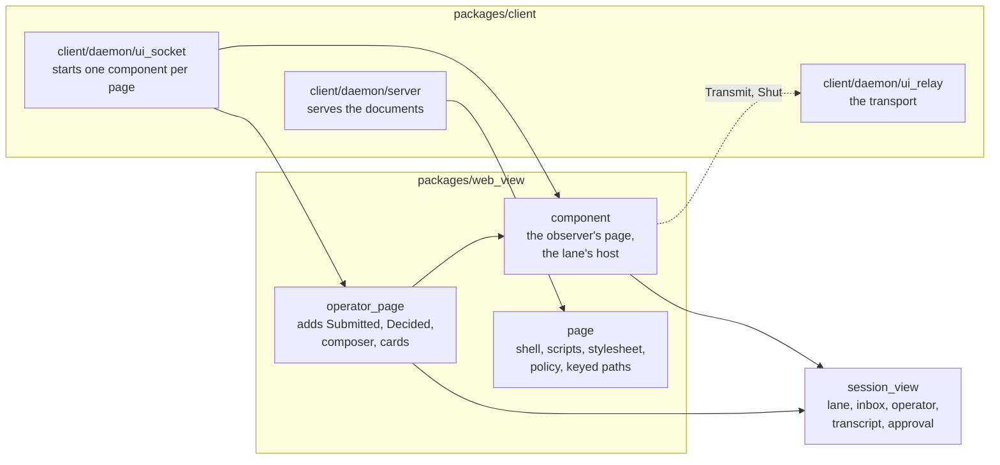
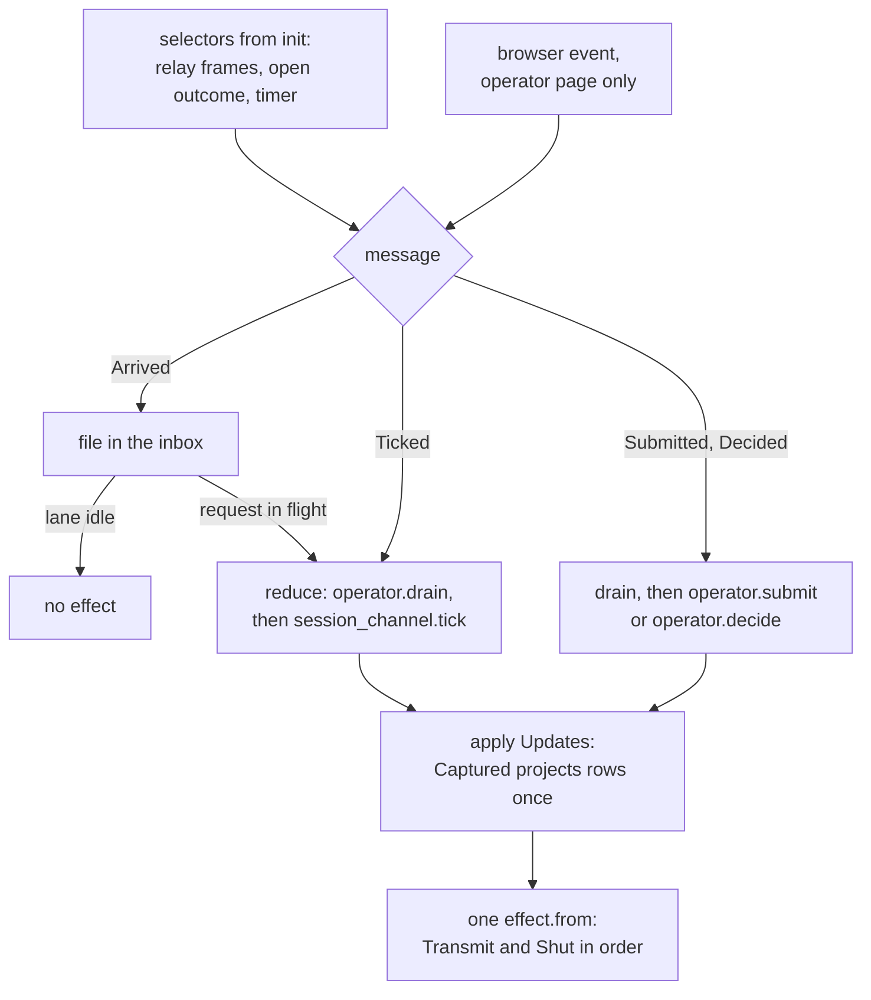

# web_view

`web_view` is the web view's host and view for one session: two Lustre
5.7.1 server components that drive `session_view`'s session lane and draw
the session's transcript as HTML, and the documents served around them.
The daemon runs one component per open page when it is started with
`loomd --ui`. The browser runs only Lustre's client runtime, which
applies the patches a component sends and sends back the events its view
attached.

The package knows nothing of the daemon. The transport the lane writes
through is handed in by `packages/client`, which owns the routes, the
tickets and cookies, the page keys and nonces, and the relay into the
session's gateway:

```gleam
pub type Transport(socket) {
  Transport(
    connect: fn(Subject(connection_event.Message), Subject(Result(socket, String))) -> Nil,
    transmit: fn(socket, String) -> Nil,
    shut: fn(socket) -> Nil,
    now: fn() -> Int,
  )
}
```

## Why it is a separate package

It is the second runtime of [ADR-014](../../docs/adr/014-second-runtime.md):
the same client engine the terminal runs, under a second host, with only
the view differing. The package boundary keeps three things apart.

- **Lustre stays out of the engine.** `session_view` is held by lint R6 to
  depend on nothing BEAM-only. A Lustre component needs `gleam_erlang`
  subjects and selectors, so the host that wraps the engine for a browser
  has to live beside it, not in it.
- **Session logic stays in the engine.** This package draws, delivers and
  performs. What a frame means, which lines a capture becomes, and what an
  operator's input becomes on the wire are `session_view`'s, where the
  terminal uses the same code. A decision about the session written here
  is a review finding.
- **The daemon's security code stays in the daemon.** Everything that
  authenticates a browser (the ticket exchange, the cookie, the page key,
  the nonce, the role cap) lives in `client/daemon/ui_*`. A component
  receives only a started transport and the attachment it must match.

## The modules



`ui_socket` picks the application from the page's capped role: an
observer's page runs `component.app()`, an operator's runs
`operator_page.app()`.

## How a message moves through a component



## A tour, in reading order

1. **`component`: the types.** `Start(socket)` is what the daemon supplies:
   the session ID, the `snapshot.Expected` attachment every cut must
   match, and the `Transport`. `Msg(socket)` is `Opened`, `Refused`,
   `TimerArmed`, `Arrived` and `Ticked`, and holds no command, which is
   what makes an observer's page unable to send one. `Model(socket)` is
   opaque: the lane, the inbox of filed frames, the last capture, the
   keyed rows and approvals projected from it, the connection `Status`,
   the operator's `Notice` and the count of sent drafts.
2. **`component.init`, `open` and `arm`.** `init` returns two
   `server_component.select` effects, one for the transport and one for a
   250 ms timer, each run once. `connect` must return at once, because
   Lustre gives `init` 1000 ms, so the relay attaches in its own process
   and answers on the `opened` subject. The clock is read in the
   selectors' mappings, so `update` reads none.
3. **`component.update`, `reduce` and `apply`.** `Arrived` files a frame,
   and reduces at once only while the lane has a request in flight.
   `Ticked` reduces every filed frame through `operator.drain`, runs the
   lane's tick, and re-arms the timer. `apply` folds the lane's `Update`s:
   `Captured` is projected once, with `transcript.project_rows`, into keyed
   rows for `main`, and its escalations into the approval list.
4. **`component.submit`, `decide` and `perform`.** The two command arms an
   operator's page calls. `submit` refuses empty text and text over
   256 KiB before it reaches the lane; `decide` answers only the record
   still pending at the drawn ID and sequence. `perform` runs the lane's
   outputs inside one `effect.from`, because Lustre's `effect.batch`
   promises no order and the lane's frames must leave in the order it
   decided them.
5. **`component.view` and `transcript_view`.** The observer's page: a
   heading, the transcript keyed by `transcript.Row.key` and memoized on
   the rows with `element.memo`, and a fixed read-only line. No event
   handler anywhere.
6. **`operator_page`.** `Msg(socket)` wraps the observer's messages in
   `Observed` and adds `Submitted(text, delivery)` and `Decided(id, seq,
   answer)`. Its view adds the composer, an uncontrolled form whose
   editor is keyed by the count of sent drafts so a send empties it, and
   the approval cards in a region below the composer, Deny first, keyed by
   the record's sequence. `composition` is the total decoder for the
   form's fields: one `draft`, at most one `delivery` of `prompt` or
   `steer`, and nothing else.
7. **`page`.** The documents: the shell with one empty
   `<lustre-server-component>`, the exchange page that carries the keyed
   path and the nonce, the two scripts that keep the nonce in
   `sessionStorage` and set `csrf-token` before `route`, the stylesheet,
   the keyed path helpers, and `content_security_policy`. None of it holds
   inline script or style.

Paths are relative to `packages/web_view/src/`: `component` is
`packages/web_view/src/web_view/component.gleam`.

## How it is tested

- **In this package**, `make check-web_view` runs the tests in `test/`.
  `component_test` drives the observer's component through
  `lustre/dev/simulate`: an awaited reply reduced on arrival, a push to an
  idle lane waiting for the tick, a refused open, a closed connection, and
  an observer's page with no handler and no card. `operator_page_test`
  covers prompts and steers, the form decoder refusing unexpected fields,
  Enter never deciding, Deny first, decisions carrying the drawn identity
  and sequence, a stale decision sending nothing, and an observer's
  attachment sending no command. `page_fixture` runs a page's `update`
  and performs its effects, so a test can read exactly what the page
  wrote to its transport.
- **In `packages/client`**, `web_view_parity_test` checks that the
  component draws the same lines as the terminal's projection for one
  capture and that its HTML carries them escaped and in order, and
  `web_operator_page_test` and the `ui_*_test` modules cover the socket,
  the relay and the route's defences around the component.

## Reading further

- [`CLAUDE.md`](CLAUDE.md): key types, traffic and invariants, to read
  before changing this package.
- [The web view](../../docs/architecture/web-view.md): the architecture
  map, from `loom --ui` to a live socket, and the security layers.
- [Writing the web view with Lustre](../../docs/lustre.md): how Lustre
  server components work, the rules for view code, and the checklist for a
  change here.
- [ADR-014](../../docs/adr/014-second-runtime.md): one engine, two views.
- [protocol-change/051](../../protocol-change/051-web-view-route.md): the
  routes, authentication, the relay, and the operator addendum.
- [The web UI design note](../../docs/design-notes/web-ui.md): where the
  page is going.
